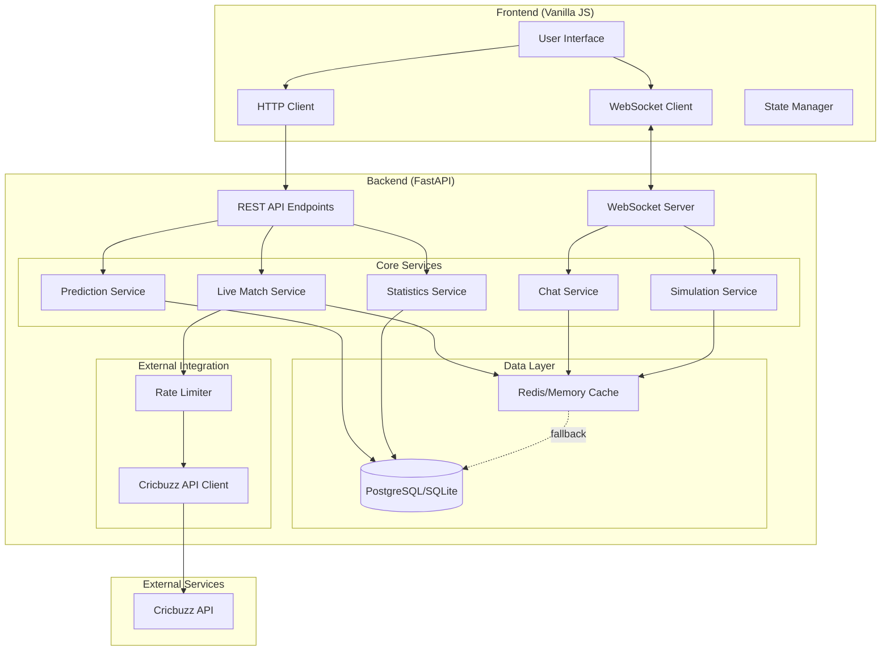

# Design Document: IPL Live Score Integration

## Overview

This design enhances an existing IPL match simulation platform by integrating live cricket scores from external APIs, improving the prediction system, adding social engagement features, and implementing comprehensive data visualization. The architecture maintains the existing FastAPI backend and vanilla JavaScript frontend while adding new components for live data fetching, caching, persistent storage, and real-time communication.

The system will support two operational modes:
1. **Live Mode**: Fetches real-time data from Cricbuzz API for ongoing IPL matches
2. **Simulation Mode**: Continues existing ball-by-ball simulation functionality

Key design principles:
- **Resilience**: Graceful degradation when external services fail
- **Performance**: Caching and rate limiting to minimize API calls
- **Scalability**: Support for multiple concurrent matches and users
- **Maintainability**: Clear separation of concerns between live and simulated data flows

## Architecture

### High-Level Architecture



### Component Responsibilities

**Frontend Components:**
- **User Interface**: Renders match data, predictions, chat, and visualizations
- **WebSocket Client**: Maintains real-time connection for live updates
- **HTTP Client**: Handles REST API requests for match data and user actions
- **State Manager**: Manages application state and mode switching

**Backend Services:**
- **Live Match Service**: Fetches, processes, and distributes live match data
- **Simulation Service**: Generates simulated match events (existing functionality)
- **Prediction Service**: Manages user predictions, XP calculation, and leaderboards
- **Chat Service**: Handles real-time chat rooms and reactions
- **Statistics Service**: Aggregates and serves player/team statistics

**Data Layer:**
- **Cache**: Short-term storage for API responses (10-15 second TTL)
- **Database**: Persistent storage for users, predictions, match history, statistics

**External Integration:**
- **Rate Limiter**: Controls API request frequency (max 6 requests/minute)
- **API Client**: Handles HTTP requests to Cricbuzz with error handling

## Components and Interfaces

### 1. Live Match Service

**Purpose**: Fetch and process live match data from external APIs

**Interface:**
```python
class LiveMatchService:
    async def get_live_matches() -> List[LiveMatch]:
        """Fetch all currently live IPL matches"""
        
    async def get_match_details(match_id: str) -> MatchDetails:
        """Get detailed information for a specific match"""
        
    async def get_ball_by_ball(match_id: str) -> List[BallEvent]:
        """Get ball-by-ball commentary for a match"""
        
    async def start_live_updates(match_id: str) -> None:
        """Start periodic updates for a live match"""
        
    async def stop_live_updates(match_id: str) -> None:
        """Stop periodic updates for a match"""
```

**Implementation Details:**
- Uses asyncio tasks for periodic polling (every 10-15 seconds)
- Checks cache before making external API calls
- Broadcasts updates via WebSocket when new data arrives
- Handles API failures with exponential backoff
- Parses Cricbuzz API responses into internal data models

### 2. API Client and Rate Limiter

**Purpose**: Manage external API requests with rate limiting and caching

**Interface:**
```python
class CricbuzzAPIClient:
    async def fetch_live_matches() -> dict:
        """Fetch live matches from Cricbuzz"""
        
    async def fetch_match_details(match_id: str) -> dict:
        """Fetch match details from Cricbuzz"""
        
    async def fetch_commentary(match_id: str) -> dict:
        """Fetch ball-by-ball commentary"""

class RateLimiter:
    async def acquire(key: str) -> bool:
        """Attempt to acquire rate limit token"""
        
    def get_wait_time(key: str) -> float:
        """Get time until next available slot"""
```

**Implementation Details:**
- Token bucket algorithm for rate limiting (6 requests/minute)
- Separate rate limit buckets per API endpoint
- Request queuing when rate limit is reached
- Timeout handling (2 second timeout per request)
- Retry logic with exponential backoff (max 3 retries)

### 3. Cache Layer

**Purpose**: Reduce external API calls and improve response times

**Interface:**
```python
class CacheService:
    async def get(key: str) -> Optional[Any]:
        """Retrieve cached value"""
        
    async def set(key: str, value: Any, ttl: int) -> None:
        """Store value with time-to-live"""
        
    async def delete(key: str) -> None:
        """Remove cached value"""
        
    async def exists(key: str) -> bool:
        """Check if key exists in cache"""
```

**Implementation Details:**
- In-memory cache for development (Python dict with TTL)
- Redis for production deployment
- TTL of 10 seconds for live match data
- TTL of 60 seconds for match schedules
- TTL of 300 seconds for historical data
- Cache key format: `{resource_type}:{match_id}:{timestamp}`

### 4. Prediction Service

**Purpose**: Manage user predictions, accuracy tracking, and XP rewards

**Interface:**
```python
class PredictionService:
    async def create_prediction(
        user_id: str,
        match_id: str,
        match_type: MatchType,
        prediction: PredictionData
    ) -> Prediction:
        """Record a new prediction"""
        
    async def evaluate_prediction(
        prediction_id: str,
        actual_outcome: OutcomeData
    ) -> PredictionResult:
        """Evaluate prediction and award XP"""
        
    async def get_user_predictions(
        user_id: str,
        match_type: Optional[MatchType]
    ) -> List[Prediction]:
        """Get user's prediction history"""
        
    async def get_leaderboard(
        match_type: Optional[MatchType],
        limit: int
    ) -> List[LeaderboardEntry]:
        """Get ranked leaderboard"""
        
    async def calculate_streak_bonus(user_id: str) -> int:
        """Calculate bonus XP for consecutive correct predictions"""
```

**Implementation Details:**
- Stores predictions in database with timestamp and match context
- Separate accuracy tracking for live vs simulated matches
- Streak bonus: 2x XP for 3+ consecutive correct predictions, 3x for 5+
- Leaderboard updates in real-time using database triggers
- Prediction locking: predictions locked once ball is bowled

### 5. Statistics Service

**Purpose**: Aggregate and serve player and team statistics

**Interface:**
```python
class StatisticsService:
    async def update_player_stats(
        match_id: str,
        player_stats: List[PlayerPerformance]
    ) -> None:
        """Update player statistics after match"""
        
    async def get_player_stats(
        player_id: str,
        season: Optional[str]
    ) -> PlayerStats:
        """Get aggregated player statistics"""
        
    async def get_team_standings() -> List[TeamStanding]:
        """Get current IPL points table"""
        
    async def update_team_standings(match_result: MatchResult) -> None:
        """Update standings after match completion"""
```

**Implementation Details:**
- Aggregates statistics using SQL queries
- Calculates derived metrics (strike rate, economy, net run rate)
- Updates triggered by match completion events
- Caches aggregated statistics for 5 minutes
- Supports filtering by season and match type

### 6. Chat Service

**Purpose**: Handle real-time chat rooms and user reactions

**Interface:**
```python
class ChatService:
    async def join_room(match_id: str, user_id: str, websocket: WebSocket) -> None:
        """Add user to match-specific chat room"""
        
    async def leave_room(match_id: str, user_id: str) -> None:
        """Remove user from chat room"""
        
    async def broadcast_message(
        match_id: str,
        message: ChatMessage
    ) -> None:
        """Send message to all users in room"""
        
    async def broadcast_reaction(
        match_id: str,
        ball_id: str,
        reaction: Reaction
    ) -> None:
        """Broadcast emoji reaction to specific ball"""
```

**Implementation Details:**
- Maintains WebSocket connections per match room
- Message rate limiting: 5 messages per user per minute
- Stores recent messages in cache (last 100 messages per room)
- Supports emoji reactions tied to specific ball events
- Broadcasts reactions with aggregated counts

### 7. WebSocket Server

**Purpose**: Manage real-time bidirectional communication

**Interface:**
```python
class WebSocketManager:
    async def connect(websocket: WebSocket, match_id: str, user_id: str) -> None:
        """Establish WebSocket connection"""
        
    async def disconnect(websocket: WebSocket) -> None:
        """Close WebSocket connection"""
        
    async def send_personal_message(message: dict, websocket: WebSocket) -> None:
        """Send message to specific client"""
        
    async def broadcast_to_match(match_id: str, message: dict) -> None:
        """Broadcast message to all clients watching a match"""
```

**Implementation Details:**
- Connection pooling per match
- Heartbeat/ping every 30 seconds to detect disconnections
- Automatic reconnection with exponential backoff on client side
- Message serialization using JSON
- Error handling for closed connections

## Data Models

### Core Data Structures

```python
from enum import Enum
from datetime import datetime
from typing import Optional, List
from pydantic import BaseModel

class MatchType(str, Enum):
    LIVE = "live"
    SIMULATED = "simulated"

class MatchStatus(str, Enum):
    SCHEDULED = "scheduled"
    LIVE = "live"
    COMPLETED = "completed"
    ABANDONED = "abandoned"

class LiveMatch(BaseModel):
    match_id: str
    team1: str
    team2: str
    team1_score: str  # e.g., "185/6"
    team2_score: str
    overs: float
    status: MatchStatus
    current_batsmen: List[str]
    current_bowler: str
    last_updated: datetime

class BallEvent(BaseModel):
    ball_id: str
    match_id: str
    over: float
    batsman: str
    bowler: str
    runs: int
    is_wicket: bool
    commentary: str
    timestamp: datetime

class Prediction(BaseModel):
    prediction_id: str
    user_id: str
    match_id: str
    match_type: MatchType
    predicted_outcome: str  # e.g., "6", "wicket", "dot"
    actual_outcome: Optional[str]
    is_correct: Optional[bool]
    xp_awarded: int
    created_at: datetime
    evaluated_at: Optional[datetime]

class PlayerStats(BaseModel):
    player_id: str
    player_name: str
    matches_played: int
    runs_scored: int
    wickets_taken: int
    strike_rate: float
    economy_rate: float
    average: float

class TeamStanding(BaseModel):
    team_name: str
    matches_played: int
    wins: int
    losses: int
    points: int
    net_run_rate: float
    position: int

class ChatMessage(BaseModel):
    message_id: str
    match_id: str
    user_id: str
    username: str
    content: str
    timestamp: datetime

class Reaction(BaseModel):
    reaction_id: str
    match_id: str
    ball_id: str
    user_id: str
    emoji: str
    timestamp: datetime
```

### Database Schema

```sql
-- Users table (if authentication enabled)
CREATE TABLE users (
    user_id UUID PRIMARY KEY DEFAULT gen_random_uuid(),
    username VARCHAR(50) UNIQUE NOT NULL,
    email VARCHAR(255) UNIQUE,
    password_hash VARCHAR(255),
    total_xp INTEGER DEFAULT 0,
    created_at TIMESTAMP DEFAULT CURRENT_TIMESTAMP
);

-- Predictions table
CREATE TABLE predictions (
    prediction_id UUID PRIMARY KEY DEFAULT gen_random_uuid(),
    user_id UUID REFERENCES users(user_id),
    match_id VARCHAR(100) NOT NULL,
    match_type VARCHAR(20) NOT NULL,
    predicted_outcome VARCHAR(50) NOT NULL,
    actual_outcome VARCHAR(50),
    is_correct BOOLEAN,
    xp_awarded INTEGER DEFAULT 0,
    created_at TIMESTAMP DEFAULT CURRENT_TIMESTAMP,
    evaluated_at TIMESTAMP,
    INDEX idx_user_predictions (user_id, created_at),
    INDEX idx_match_predictions (match_id)
);

-- Match history table
CREATE TABLE match_history (
    match_id VARCHAR(100) PRIMARY KEY,
    match_type VARCHAR(20) NOT NULL,
    team1 VARCHAR(100) NOT NULL,
    team2 VARCHAR(100) NOT NULL,
    winner VARCHAR(100),
    final_score_team1 VARCHAR(50),
    final_score_team2 VARCHAR(50),
    match_date DATE NOT NULL,
    status VARCHAR(20) NOT NULL,
    created_at TIMESTAMP DEFAULT CURRENT_TIMESTAMP,
    INDEX idx_match_date (match_date)
);

-- Player statistics table
CREATE TABLE player_stats (
    player_id VARCHAR(100) PRIMARY KEY,
    player_name VARCHAR(100) NOT NULL,
    team VARCHAR(100),
    matches_played INTEGER DEFAULT 0,
    runs_scored INTEGER DEFAULT 0,
    wickets_taken INTEGER DEFAULT 0,
    balls_faced INTEGER DEFAULT 0,
    balls_bowled INTEGER DEFAULT 0,
    runs_conceded INTEGER DEFAULT 0,
    updated_at TIMESTAMP DEFAULT CURRENT_TIMESTAMP
);

-- Team standings table
CREATE TABLE team_standings (
    team_name VARCHAR(100) PRIMARY KEY,
    season VARCHAR(20) NOT NULL,
    matches_played INTEGER DEFAULT 0,
    wins INTEGER DEFAULT 0,
    losses INTEGER DEFAULT 0,
    no_result INTEGER DEFAULT 0,
    points INTEGER DEFAULT 0,
    net_run_rate DECIMAL(5,3) DEFAULT 0.0,
    updated_at TIMESTAMP DEFAULT CURRENT_TIMESTAMP
);

-- Achievements table
CREATE TABLE achievements (
    achievement_id UUID PRIMARY KEY DEFAULT gen_random_uuid(),
    user_id UUID REFERENCES users(user_id),
    badge_type VARCHAR(50) NOT NULL,
    badge_name VARCHAR(100) NOT NULL,
    earned_at TIMESTAMP DEFAULT CURRENT_TIMESTAMP,
    INDEX idx_user_achievements (user_id)
);
```


## Correctness Properties

*A property is a characteristic or behavior that should hold true across all valid executions of a system—essentially, a formal statement about what the system should do. Properties serve as the bridge between human-readable specifications and machine-verifiable correctness guarantees.*

### Property 1: Live match display completeness
*For any* live match data received from the API, the rendered display should contain team names, current scores, overs completed, current batsmen, current bowlers, and match status.
**Validates: Requirements 1.5**

### Property 2: View state preservation during mode switching
*For any* application state (including predictions and chat history), switching from Live mode to Simulated mode and back to Live mode should preserve the original state.
**Validates: Requirements 1.6, 12.3**

### Property 3: Match completion persistence
*For any* live match that reaches completed status, the system should mark it as completed in the database and store all final statistics.
**Validates: Requirements 1.7**

### Property 4: Schedule display completeness
*For any* match schedule data, the rendered display should contain date, time, and team information for each match.
**Validates: Requirements 2.1**

### Property 5: Data persistence round-trip
*For any* user profile, prediction, or match data written to the Data_Store, reading it back should return equivalent data.
**Validates: Requirements 2.2, 8.1, 8.2, 8.3**

### Property 6: Match highlights display
*For any* completed match with recorded events, the highlights timeline should display all key events in chronological order.
**Validates: Requirements 2.3**

### Property 7: Historical data completeness
*For any* historical match data, the rendered display should include final scores, player performances, and match statistics.
**Validates: Requirements 2.4**

### Property 8: Chronological match ordering
*For any* list of matches, they should be ordered by date in chronological order (earliest to latest).
**Validates: Requirements 2.5**

### Property 9: Prediction metadata completeness
*For any* prediction submission (live or simulated), the stored record should contain timestamp, match context, and match type.
**Validates: Requirements 3.1, 3.2**

### Property 10: Leaderboard filtering correctness
*For any* leaderboard query filtered by match type, all returned entries should only include predictions of that specified type, and accuracy calculations should only consider predictions of that type.
**Validates: Requirements 3.3, 3.5**

### Property 11: Streak bonus calculation
*For any* user with N consecutive correct predictions on live matches, where N ≥ 3, the XP awarded for the Nth prediction should include a multiplier (2x for 3-4 correct, 3x for 5+ correct).
**Validates: Requirements 3.4**

### Property 12: Prediction history with accuracy
*For any* user with at least one prediction, their prediction history display should include calculated accuracy percentage.
**Validates: Requirements 3.6**

### Property 13: XP update propagation
*For any* prediction evaluation that awards XP, querying the leaderboard immediately after should reflect the updated XP total for that user.
**Validates: Requirements 3.7**

### Property 14: Statistics display completeness
*For any* player statistics or team standings data, the rendered display should include all required fields (for players: runs, wickets, strike rate, economy rate; for teams: points, wins, losses, net run rate).
**Validates: Requirements 4.2, 4.4**

### Property 15: Chat room connection
*For any* user joining a match view, they should be connected to that match's specific chat room and able to send/receive messages.
**Validates: Requirements 5.1**

### Property 16: Room broadcast delivery
*For any* message, reaction, or poll sent to a match room, all users currently connected to that room should receive it.
**Validates: Requirements 5.3, 5.5**

### Property 17: Emoji reaction support
*For any* valid emoji character, the system should accept it as a reaction and associate it with the specified ball event.
**Validates: Requirements 5.4**

### Property 18: Achievement badge awarding
*For any* user reaching a prediction milestone (e.g., 10 correct predictions, 100 total predictions), they should be awarded the corresponding achievement badge.
**Validates: Requirements 5.6**

### Property 19: Profile display completeness
*For any* user profile view, the rendered display should include statistics, earned badges, and prediction history.
**Validates: Requirements 5.7**

### Property 20: Cache-first data retrieval
*For any* request for match data, if valid cached data exists (not expired), it should be returned without making an external API call.
**Validates: Requirements 7.1**

### Property 21: Rate limiter enforcement
*For any* sequence of API requests to the Score_Provider within a 60-second window, no more than 6 requests should be allowed through.
**Validates: Requirements 7.3**

### Property 22: Fallback to cache on failure
*For any* API request that is blocked by rate limiting or times out, if cached data exists, it should be served as the response.
**Validates: Requirements 7.4, 9.5**

### Property 23: Request queuing when rate limited
*For any* API request that is blocked by rate limiting when no cached data exists, the request should be queued for execution in the next available time slot.
**Validates: Requirements 7.5**

### Property 24: Transaction atomicity
*For any* database transaction involving multiple operations, either all operations should succeed and be committed, or all should fail and be rolled back.
**Validates: Requirements 8.5**

### Property 25: WebSocket reconnection with backoff
*For any* WebSocket connection failure, reconnection attempts should follow exponential backoff (e.g., 1s, 2s, 4s, 8s delays).
**Validates: Requirements 9.2**

### Property 26: Operation queuing during database outage
*For any* database operation attempted while the Data_Store is unavailable, the operation should be cached in memory and retried when the database becomes available.
**Validates: Requirements 9.3**

### Property 27: User-friendly error messages
*For any* error condition (API failure, timeout, validation error), the system should display a user-friendly error message (not technical stack traces).
**Validates: Requirements 9.4**

### Property 28: Comprehensive event logging
*For any* API request, error, or significant system event, a log entry with contextual information (timestamp, user, action, result) should be created.
**Validates: Requirements 7.6, 9.6**

### Property 29: User registration and authentication
*For any* valid registration data (unique email, valid password), a user account should be created and the user should be able to log in with those credentials.
**Validates: Requirements 10.1, 10.2**

### Property 30: Authenticated prediction association
*For any* prediction made by an authenticated user, the prediction should be associated with their user account and persist across sessions.
**Validates: Requirements 10.3**

### Property 31: Anonymous user session storage
*For any* anonymous user (when authentication is disabled), their predictions and XP should be stored in browser session storage and available during that session.
**Validates: Requirements 10.4**

### Property 32: Session cleanup on logout
*For any* authenticated user who logs out, their session should be cleared from both server and client storage.
**Validates: Requirements 10.5**

## Error Handling

### Error Categories and Responses

**1. External API Failures**
- **Scenario**: Cricbuzz API is unavailable or returns errors
- **Response**: 
  - Serve cached data if available (with staleness indicator)
  - Fall back to simulated matches
  - Display clear error message: "Live scores temporarily unavailable"
  - Log error with API response details
  - Retry with exponential backoff (1s, 2s, 4s, max 3 retries)

**2. Rate Limiting**
- **Scenario**: API rate limit exceeded (>6 requests/minute)
- **Response**:
  - Serve cached data if available
  - Queue request for next available slot
  - Display message: "Updating scores..." (if user-initiated)
  - Do not expose rate limiting to users

**3. Database Failures**
- **Scenario**: PostgreSQL/SQLite connection lost or query fails
- **Response**:
  - Cache write operations in memory
  - Retry operations when connection restored
  - For read operations, return cached data if available
  - Display error: "Unable to save data, retrying..."
  - Log error with query details

**4. WebSocket Disconnections**
- **Scenario**: WebSocket connection drops
- **Response**:
  - Attempt automatic reconnection with exponential backoff
  - Display connection status indicator
  - Queue messages sent during disconnection
  - Resend queued messages on reconnection
  - Fall back to HTTP polling if WebSocket unavailable

**5. Validation Errors**
- **Scenario**: Invalid user input (empty prediction, invalid emoji, etc.)
- **Response**:
  - Display field-specific error message
  - Preserve user input for correction
  - Highlight invalid fields
  - Do not submit invalid data

**6. Authentication Errors**
- **Scenario**: Invalid credentials, expired session, unauthorized access
- **Response**:
  - Display clear error message
  - Redirect to login page for expired sessions
  - Preserve intended action for post-login redirect
  - Log authentication failures for security monitoring

### Error Recovery Strategies

**Graceful Degradation:**
- Live scores unavailable → Continue with simulations
- Database unavailable → Use in-memory cache
- WebSocket unavailable → Fall back to HTTP polling
- Visualizations fail → Display raw data in tables

**Retry Logic:**
- API calls: 3 retries with exponential backoff
- Database operations: Infinite retries with backoff (until success or manual intervention)
- WebSocket reconnection: Infinite retries with capped backoff (max 30s)

**User Communication:**
- All errors display user-friendly messages
- Technical details logged but not shown to users
- Status indicators for connection state
- Toast notifications for transient errors
- Modal dialogs for critical errors requiring user action

## Testing Strategy

### Dual Testing Approach

This feature requires both **unit tests** and **property-based tests** for comprehensive coverage:

- **Unit tests**: Verify specific examples, edge cases, and error conditions
- **Property tests**: Verify universal properties across all inputs

Both testing approaches are complementary and necessary. Unit tests catch concrete bugs in specific scenarios, while property tests verify general correctness across a wide range of inputs.

### Property-Based Testing

**Framework Selection:**
- **Python backend**: Use `hypothesis` library for property-based testing
- **JavaScript frontend**: Use `fast-check` library for property-based testing

**Configuration:**
- Each property test must run minimum **100 iterations** to ensure adequate coverage
- Each test must be tagged with a comment referencing the design property
- Tag format: `# Feature: ipl-live-score-integration, Property {number}: {property_text}`

**Property Test Implementation:**
Each correctness property listed above must be implemented as a single property-based test. For example:

```python
# Feature: ipl-live-score-integration, Property 5: Data persistence round-trip
@given(user_profile=user_profile_strategy())
@settings(max_examples=100)
def test_user_profile_persistence_round_trip(user_profile):
    # Write user profile to database
    stored_id = db.save_user_profile(user_profile)
    
    # Read it back
    retrieved_profile = db.get_user_profile(stored_id)
    
    # Should be equivalent
    assert retrieved_profile == user_profile
```

### Unit Testing

**Focus Areas for Unit Tests:**
- Specific examples demonstrating correct behavior
- Edge cases (empty lists, null values, boundary conditions)
- Error conditions (API failures, invalid input, timeouts)
- Integration points between components

**Balance:**
- Avoid writing too many unit tests for scenarios covered by property tests
- Property tests handle comprehensive input coverage
- Unit tests should focus on concrete examples and integration

### Test Coverage by Component

**Live Match Service:**
- Property tests: Cache-first retrieval, rate limiting, fallback behavior
- Unit tests: API response parsing, specific error scenarios, WebSocket broadcasting

**Prediction Service:**
- Property tests: Streak bonus calculation, leaderboard filtering, XP propagation
- Unit tests: Specific prediction scenarios, edge cases (first prediction, tie-breaking)

**Statistics Service:**
- Property tests: Data persistence round-trip, display completeness
- Unit tests: Specific stat calculations, aggregation edge cases

**Chat Service:**
- Property tests: Room broadcast delivery, emoji support
- Unit tests: Message rate limiting, specific chat scenarios

**Cache Layer:**
- Property tests: Cache-first behavior, TTL expiration
- Unit tests: Specific caching scenarios, cache invalidation

**Error Handling:**
- Property tests: User-friendly error messages, logging completeness
- Unit tests: Specific error scenarios, recovery paths

### Integration Testing

**End-to-End Scenarios:**
- Complete user flow: view live match → make prediction → earn XP → check leaderboard
- Mode switching: live → simulated → live with state preservation
- Error recovery: API failure → fallback to cache → API recovery
- Real-time updates: match event → WebSocket broadcast → UI update

**Performance Testing:**
- Load testing with multiple concurrent matches
- Stress testing with many simultaneous users
- Rate limiting under high load
- Database query performance with large datasets

### Manual Testing Checklist

- [ ] Responsive design on mobile devices (320px to 2560px)
- [ ] WebSocket reconnection behavior
- [ ] Visual appearance of charts and graphs
- [ ] User experience during error conditions
- [ ] Cross-browser compatibility (Chrome, Firefox, Safari, Edge)
- [ ] Accessibility with screen readers (WCAG compliance requires expert review)
