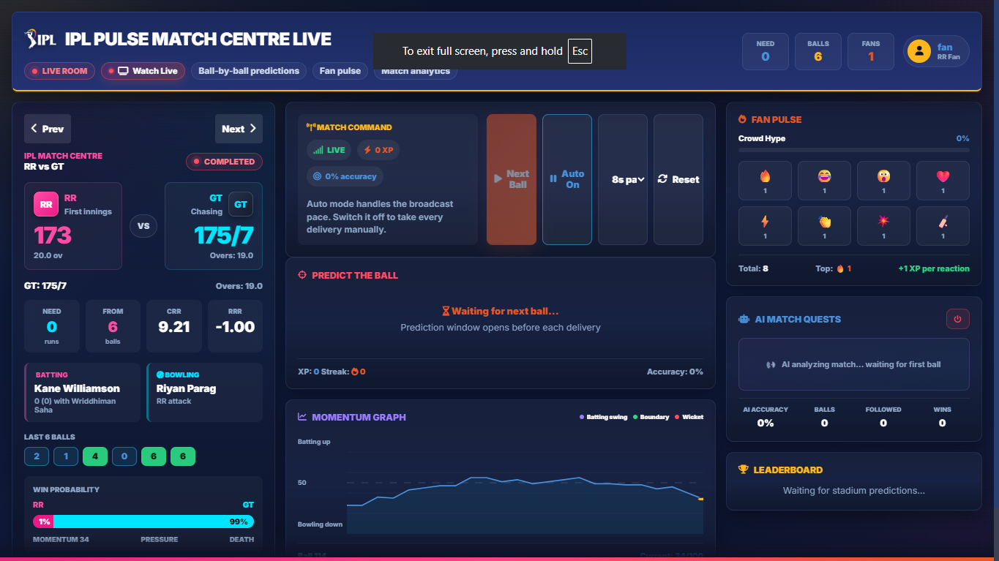

#  IPL Pulse Match Centre

A real-time, interactive, and highly gamified live cricket match dashboard built for the Indian Premier League (IPL). IPL Pulse brings the broadcast experience to the web, featuring live scores via Cricbuzz integration, dynamic AI predictions, live fan reactions, and a real-time leaderboard.



---

## ✨ Features

- **Live Match Data Integration:** Real-time polling of live scores, ball-by-ball commentary, and active player stats via the RapidAPI Cricbuzz API.
- **Smart Fallback Engine:** Automatically detects when no live matches are available and falls back to a realistic, simulated replay of past matches so the dashboard never looks empty.
- **Dynamic AI Match Assistant:** Context-aware, ball-by-ball AI predictions that analyze run rates, current batters, and match situations to provide intelligent insights.
- **Interactive Fan Pulse:** Users can send live animated reactions (🔥, 😂, 😲, etc.) during the match, which sync across all connected clients in real-time.
- **Gamified Leaderboard:** Users earn Stadium XP by predicting outcomes or interacting with the dashboard, climbing the live leaderboard.
- **Fully Responsive UI:** A premium, broadcast-style dark-mode interface built with CSS Grid and Flexbox that flawlessly adapts from large desktop monitors down to mobile screens.
- **Live Streaming Integration:** Built-in floating header button that links directly to JioHotstar for instant live streaming access.

---

## 🛠️ Tech Stack

**Frontend**
- HTML5, CSS3 (Vanilla)
- Vanilla JavaScript (ES6 Modules)
- WebSocket Client for Real-time sync

**Backend**
- Python 3.x
- **FastAPI**: High-performance async web framework.
- **Uvicorn**: ASGI web server.
- **WebSockets**: Real-time bidirectional event streaming.
- **SQLite + aiosqlite**: Async database for user profiles, XP, and predictions.
- **RapidAPI (Cricbuzz)**: Data provider for live match tracking.

---

## 📂 Project Architecture

```
📦 IPL-Pulse
├── 📂 backend/               # FastAPI Backend Server
│   ├── 📂 database/          # SQLite connection and repository logic
│   ├── 📂 middleware/        # Authentication and error handling
│   ├── 📂 services/          # Core logic (Match, Stats, Users, WebSockets)
│   ├── 📂 cricbuzz/          # API Clients for Cricbuzz & Fallback data
│   ├── ai_engine.py          # AI Prediction Generation
│   ├── match_engine.py       # Fallback Simulation Engine
│   └── main.py               # Application Entry Point & Routes
│
├── 📂 frontend/              # Vanilla JS & CSS Frontend
│   ├── 📂 components/        # Reusable JS UI components (ScoreCard, FanPulse, etc.)
│   ├── 📂 css/               # Modular stylesheets
│   ├── app.js                # Frontend entry point & WebSocket handler
│   ├── dashboard.html        # Main dashboard view
│   ├── index.html            # Landing page (maps to dashboard)
│   └── styles.css            # Core styles, media queries, and animations
│
├── .env                      # Environment Variables (API Keys, DB URL)
└── README.md                 # Project Documentation
```

---

## 🚀 Getting Started

### Prerequisites
- Python 3.8+
- A [RapidAPI](https://rapidapi.com/) account (for the Cricbuzz API key)

### 1. Clone the Repository
```bash
git clone https://github.com/yourusername/ipl-pulse.git
cd ipl-pulse
```

### 2. Set Up Environment Variables
Create a `.env` file in the root directory (`ipl-pulse/.env`) and configure your API keys. The app supports multiple data providers:

```env
# Required: Groq API Key for AI Match Assistant (https://console.groq.com/keys)
GROQ_API_KEY=your_groq_api_key_here

# Required (at least one): Cricket APIs for Live Data
# Option A: CricketData.org (FREE 100 req/day) -> https://cricketdata.org
CRICDATA_API_KEY=your_cricketdata_api_key_here
CRICDATA_POLL_INTERVAL=90

# Option B: Cricbuzz via RapidAPI (FREE 200 req/month)
CRICBUZZ_API_KEY=your_rapidapi_key_here
CRICBUZZ_API_HOST=cricbuzz-cricket.p.rapidapi.com
CRICBUZZ_API_BASE_URL=https://cricbuzz-cricket.p.rapidapi.com

# Database and simulation settings
DATABASE_URL=sqlite+aiosqlite:///ipl_pulse.db
BALL_INTERVAL=8
```

### 3. Install Dependencies
Navigate to the backend directory and install the required Python packages using the provided requirements file:
```bash
cd backend
pip install -r requirements.txt
```

### 4. Run the Server
Start the FastAPI server using Uvicorn:
```bash
python main.py
```
*The server will start on `http://0.0.0.0:8081`.*

### 5. Access the Dashboard
Open your web browser and navigate to:
```
http://localhost:8081/
```

---

## ⚙️ How It Works (The Engine)

1. **Match Initialization:** Upon startup, the backend (`main.py`) attempts to connect to the configured API providers (CricketData or Cricbuzz) to find a live match.
2. **Data Streaming:** If a live match is found, the server polls the API and pushes updates to the frontend via WebSockets. If no match is found, it automatically instantiates the `MatchEngine` to simulate a fallback match.
3. **Real-time Sync:** The frontend `app.js` listens to WebSocket events (`STATE_UPDATE`, `FAN_REACTION`, `LEADERBOARD_UPDATE`) and dynamically updates the DOM components without reloading the page.

---

## 🧪 Testing

### Backend Tests
The backend uses `pytest` for unit and integration testing. Run them from the backend directory:
```bash
cd backend
pytest
```

### Frontend Tests
The frontend utilizes the native Node.js test runner for components and state management.
```bash
cd frontend
npm install
npm test
```

---

## 🛠️ Optional: Seeding the Database
If you want to test the fallback simulation engine with a full schedule of historical matches, you can seed the SQLite database using the provided script:
```bash
cd backend
python seed_real_data.py
```
*This populates the `match_history` table with real IPL match data from `schedule_data.txt`.*

---

## 🔥 Features to Try

Once your server is running, here are a few ways to test the real-time architecture:
1. **Side-by-Side WebSockets**: Open `http://localhost:8081` in two different browser windows side-by-side. Click a Fan Pulse emoji (🔥, 😂, 😲) in one window and watch it instantly animate across the other window in real-time.
2. **Leaderboard Climbing**: Predict the outcome of a delivery. If you guess right (or if the AI Assistant guesses right and you follow it), watch your Stadium XP and rank instantly update on the live leaderboard.
3. **Responsive Stress Test**: Resize your browser window from a wide desktop view down to a narrow mobile view to see the CSS Grid seamlessly restructure the dashboard into a stacked layout without breaking the live data stream.

---

## 🤝 Contributing
Contributions, issues, and feature requests are welcome! Feel free to check the issues page.

## 📝 License
This project is licensed under the MIT License - see the LICENSE file for details.
